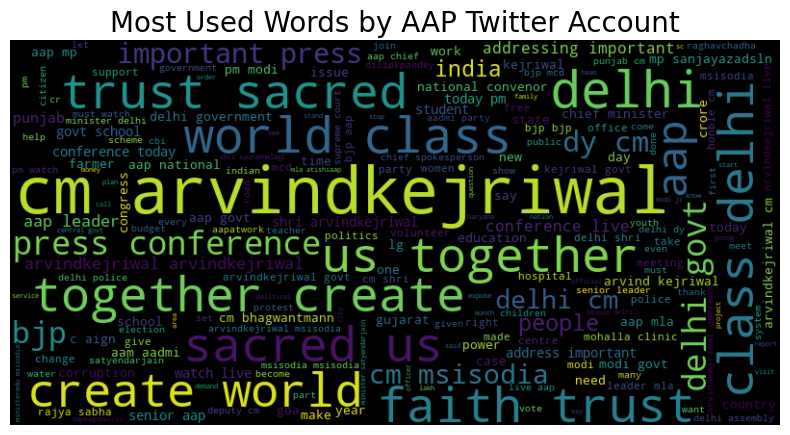
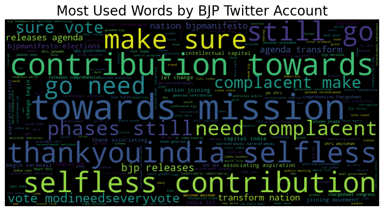
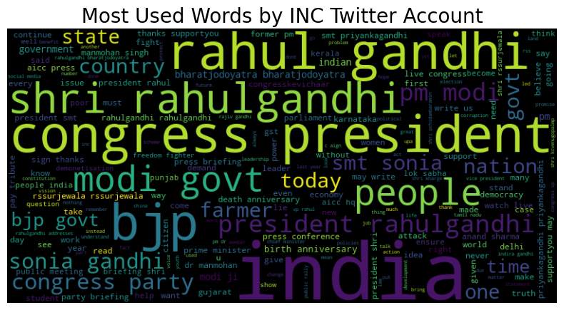

# Twitter-username-Prediction-by-Tweet

This project is based on an NLP model designed to classify and predict the political party twitter account based on the tweet content. 

# Methods Used
- Data Cleaning
- Data Wrangling
- Data Preprocessing
- Data Visualisation
- Tokenisation
- Word Embedding
- Deep Learning (Long Short Term Memory Neural Network
- Model Deployment using Flask

# Technologies Used
- Python
- Jupyter
- Numpy, Pandas, NLTK
- WordCloud
- Scikit Learn, Tensorflow
- Flask
- HTML

# Project Description
- Project began with fetching of last 10-year twitter data from [Kaggle dataset](https://www.kaggle.com/datasets/aryansingh0909/indian-political-party-tweets-daily-updated)
- Data is preprocessed by using regex, stemming and tokenisation
- Visualisation is done to see the most used words by each political party using WordCloud
- Dataset is divided in 80:20 ratio as train and test dataset
- Model is trained with LSTM neural network

# Visulisation

# Findings
The architecture and parameters used in this neural network are capable of producing an accuracy of 94% on Test Data

# Creating Web API using Flask
- Created backend using Flask and web page using HTML to provide an interface to the LSTM-RNN model

# How to Use 
- Fork this repository to have your own copy
- Clone your copy on your local system
- Install necessary packages from requirements.txt file
- run app.py file
